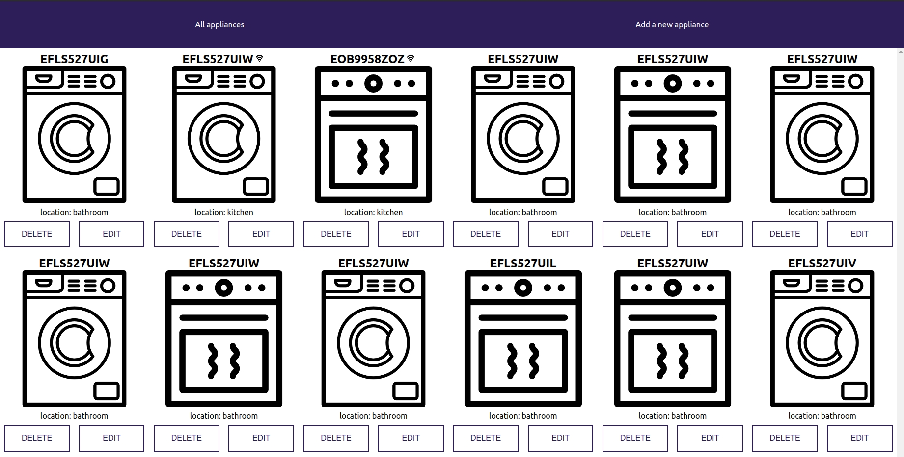
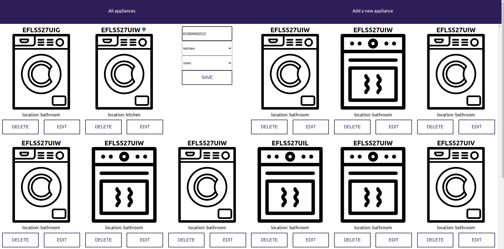
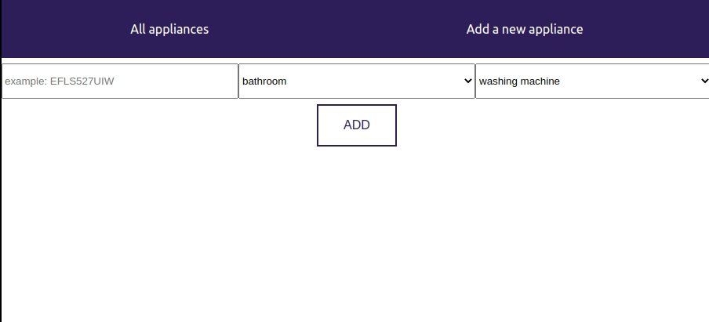

# ApplianceController
This app will help you to control your smart home appliances

## Stack
MERN (MongoDB, Express, React, Node), Redux, Redux-Thunk, CSS, Chai, Mocha, Enzyme

## How to start

```
cd backend/ 

npm i
server: nodemon server.js
test: npm test

cd ..
cd frontend/

yarn install
app: yarn start
test: yarn test a
```

## Take a look at all of your appliances


## Edit or delete the appliance


## Add your new appliances

